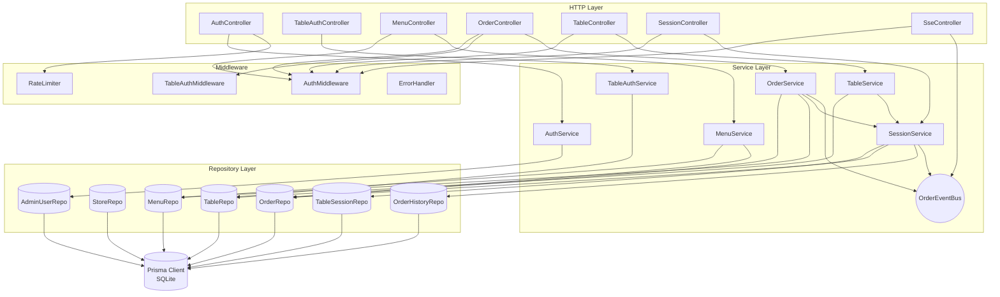
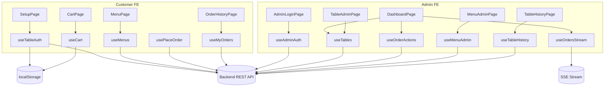

# Component Dependency — 테이블오더 서비스

## 1. Backend Component Dependency Matrix

| From \ To | Controller | Service | Repository | Middleware | EventBus | Prisma |
|---|---|---|---|---|---|---|
| **Controller** | — | ✅ | — | ✅ (pipeline) | — | — |
| **Service** | — | ✅ (일부) | ✅ | — | ✅ | — |
| **Repository** | — | — | — | — | — | ✅ |
| **Middleware** | — | ✅ (Auth) | — | — | — | — |

**Service 간 의존**:
- `OrderService` → `SessionService`, `OrderEventBus`
- `TableService` → `SessionService`
- `MenuService` → (`OrderRepository` 참조 체크)
- `AuthService`, `TableAuthService` → 독립

---

## 2. Communication Patterns

| Pattern | 대상 | 설명 |
|---|---|---|
| **Request/Response** | HTTP REST | Frontend ↔ Backend Controllers |
| **Server-Sent Events (SSE)** | `GET /api/admin/orders/stream` | Backend → Admin FE, 단방향 실시간 push |
| **In-process Pub/Sub** | `OrderEventBus` (EventEmitter) | Services → SseController 구독자 |
| **Direct method call** | 같은 프로세스 내 | Controller → Service → Repository |
| **DB Transaction** | Prisma `$transaction` | `SessionService.closeSession` 등 원자적 작업 |

---

## 3. Dependency Graph (Backend)



---

## 4. Frontend Dependency (Customer + Admin)



---

## 5. Data Flow Diagrams (주요 시나리오)

### 5.1 고객 주문 생성 → 관리자 실시간 수신

```
[Customer FE]
   │ POST /api/orders (menus[], tableId from JWT)
   ▼
[OrderController]
   │ TableAuthMiddleware 검증
   ▼
[OrderService.createOrder]
   ├─ MenuRepository.findByIds (가격 조회)
   ├─ SessionService.ensureActiveSession
   ├─ OrderRepository.create
   └─ OrderEventBus.publish(order.created)
        │
        ▼
   [in-process EventEmitter]
        │
        ▼
   [SseController] (구독자)
        │ res.write(data: ...\n\n)
        ▼
   [Admin FE / useOrdersStream]
        │ onmessage → TableCard 업데이트
        ▼
   [신규 주문 시각적 강조 — 2초 이내]
```

### 5.2 관리자 상태 전환 (대기중 → 준비중)

```
[Admin FE / useOrderActions]
   │ PATCH /api/admin/orders/:id/status
   ▼
[OrderController] → AuthMiddleware
   ▼
[OrderService.changeStatus]
   ├─ OrderRepository.findById
   ├─ OrderStatusMachine.assertTransition (엄격 검증)
   ├─ OrderRepository.updateStatus
   └─ OrderEventBus.publish(order.updated)
        │
        ├─▶ Admin FE (대시보드 상태 뱃지 갱신)
        └─▶ (선택) Customer FE (useMyOrders 폴링/SSE로 반영)
```

### 5.3 매장 이용 완료 (Session close)

```
[Admin FE] POST /api/admin/tables/:id/close
   ▼
[SessionController] → [SessionService.closeSession]
   ├─ Prisma.$transaction
   │   ├─ OrderRepository.findBySessionId
   │   ├─ for each → OrderHistoryRepository.createFromOrder
   │   ├─ for each → OrderRepository.delete
   │   └─ TableSessionRepository.close
   ▼
   OrderEventBus.publish(table.closed)
   ▼
[Admin FE] 해당 TableCard → 총액 0, 주문 목록 비움
```

### 5.4 고객 자동 로그인

```
[Customer FE / useTableAuth]
   │ 로드 시 localStorage에서 credential 조회
   ▼
   POST /api/table/login { storeId, tableNumber, password }
   ▼
[TableAuthService.login]
   ├─ TableRepository.findByStoreAndTableNumber
   ├─ password 비교
   └─ JWT sign
   ▼
[Customer FE] JWT를 메모리/storage 보관, 이후 API 요청에 Bearer 첨부
```

---

## 6. Unit Boundary Mapping (Units Generation 단계 예고)

| Unit 후보 | 포함 컴포넌트 |
|---|---|
| **Unit 1: Backend** | 전체 Backend 컴포넌트 (Controllers, Services, Repositories, Middleware, EventBus, SeedRunner, Prisma schema) |
| **Unit 2: Customer Frontend** | Customer FE 전체 (Pages, Hooks, Components) |
| **Unit 3: Admin Frontend** | Admin FE 전체 (Pages, Hooks, Components) |
| **Shared Package** | `types/`, `constants/`, `schemas/` (monorepo packages/shared) |

의존성:
```
Customer FE ──▶ Backend (REST)
Admin FE    ──▶ Backend (REST + SSE)
Shared      ◀── Backend, Customer FE, Admin FE (import)
```
