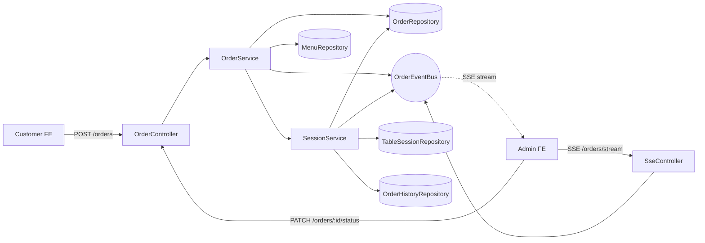

# Services (Orchestration) — 테이블오더 서비스

Service 레이어는 Controllers와 Repositories 사이에서 **도메인 규칙 실행 + 다중 Repository orchestration**을 담당합니다. 아래는 각 서비스의 orchestration 패턴과 주요 상호작용을 정의합니다.

---

## 1. AuthService
**Responsibility**: 관리자 자격 확인, JWT 발급, 로그인 시도 제한

**Orchestration**:
```
AuthController.login
  → RateLimiter.check(ip+storeId)
  → AdminUserRepository.findByStoreAndUsername
  → bcrypt.compare
  → JWT sign (16h)
  → return token
```

**의존 (Depends on)**: `AdminUserRepository`, `RateLimiter`, `bcrypt`, `jsonwebtoken`

---

## 2. TableAuthService
**Responsibility**: 테이블 자격 확인 (매장/테이블 번호/비밀번호), 테이블 토큰 발급

**Orchestration**:
```
TableAuthController.login
  → TableRepository.findByStoreAndTableNumber
  → password 비교 (평문 허용, PoC)
  → JWT sign (장기 유효 — 태블릿용)
  → return token
```

**의존**: `TableRepository`, `jsonwebtoken`

---

## 3. MenuService
**Responsibility**: 메뉴/카테고리 CRUD, 순서 조정, 참조 무결성 관리

**Orchestration**:
```
createMenu:
  → validate input (zod)
  → MenuRepository.create
  → return MenuDto

deleteMenu:
  → OrderRepository 참조 여부 확인
  → 참조 있음 → MenuRepository.softDelete
  → 참조 없음 → MenuRepository.hardDelete
```

**의존**: `MenuRepository`, `CategoryRepository`, `OrderRepository` (참조 체크)

---

## 4. OrderService ⭐ (핵심 orchestrator)
**Responsibility**: 주문 생성/조회/상태 전환/삭제, 세션 연결, 이벤트 발행

**Orchestration**:

### createOrder (고객 주문)
```
1. TableAuthMiddleware로 table context 검증
2. MenuRepository.findByIds → 가격 조회, 유효성 확인
3. SessionService.ensureActiveSession(tableId)   ← 세션 자동 시작
4. OrderRepository.create (items 포함, sessionId 연결)
5. OrderEventBus.publish({ type: 'order.created', storeId, order })
6. return OrderDto
```

### changeStatus (관리자 상태 전환)
```
1. AuthMiddleware → admin context
2. OrderRepository.findById
3. OrderStatusMachine.assertTransition(current, next)  ← 엄격 검증
4. OrderRepository.updateStatus
5. OrderEventBus.publish({ type: 'order.updated', order })
6. return OrderDto
```

### deleteOrder (직권 삭제)
```
1. AuthMiddleware → admin context
2. OrderRepository.delete
3. OrderEventBus.publish({ type: 'order.deleted', orderId, tableId })
4. return 204
```

**의존**: `OrderRepository`, `MenuRepository`, `SessionService`, `OrderEventBus`, `OrderStatusMachine` (util)

---

## 5. TableService
**Responsibility**: 테이블 설정/재설정/목록

**Orchestration**:
```
setupTable:
  → 중복 테이블 번호 체크
  → TableRepository.create
  → (비밀번호는 평문 저장, PoC)

resetTable:
  → SessionService.hasActiveSession(tableId)?
  → active 있음 → 에러 (이용 완료 선행 필요)
  → active 없음 → TableRepository.updatePassword
```

**의존**: `TableRepository`, `SessionService`

---

## 6. SessionService
**Responsibility**: 테이블 세션 라이프사이클 (시작/종료) + 이력 이동

**Orchestration**:

### ensureActiveSession (주문 생성 시 내부 호출)
```
1. TableSessionRepository.findActiveByTable(tableId)
2. 있으면 → 반환
3. 없으면 → TableSessionRepository.create(tableId)
```

### closeSession (매장 이용 완료)
```
1. 트랜잭션 시작
2. OrderRepository.findBySessionId(sessionId)
3. for each order:
     → OrderHistoryRepository.createFromOrder (items 포함)
     → OrderRepository.delete
4. TableSessionRepository.close(sessionId)
5. 트랜잭션 commit
6. OrderEventBus.publish({ type: 'table.closed', tableId })
```

**의존**: `TableSessionRepository`, `OrderRepository`, `OrderHistoryRepository`, Prisma transaction, `OrderEventBus`

---

## 7. OrderEventBus (Pub/Sub)
**Responsibility**: 도메인 이벤트를 SSE 구독자에게 브로드캐스트

**Pattern**: Node `EventEmitter` 기반 in-process, `storeId` 키로 구독 스코프 분리

```ts
publish(event):
  emitter.emit(`store:${event.storeId}`, event);

subscribe(storeId, handler):
  emitter.on(`store:${storeId}`, handler);
  return () => emitter.off(`store:${storeId}`, handler);
```

**SseController**:
```
GET /api/admin/orders/stream
  → verify JWT
  → set SSE headers
  → const unsub = OrderEventBus.subscribe(admin.storeId, event => res.write(`data: ${JSON.stringify(event)}\n\n`))
  → on close → unsub()
```

**의존**: `node:events`

---

## 8. SeedRunner
**Responsibility**: 초기 시드 데이터 생성 (개발/PoC 용)

**Execution**:
```
npm run seed
  → Prisma migrate (스키마 적용)
  → if Store 0개:
       create Store
       create AdminUser (bcrypt-hashed password)
       create Categories (한식/양식/음료 등 예시)
       create Menus (카테고리별 3~5개)
       create Tables (1~5번, 초기 비밀번호)
```

**의존**: `Prisma Client`, `bcrypt`

---

## Service Interaction Diagram


