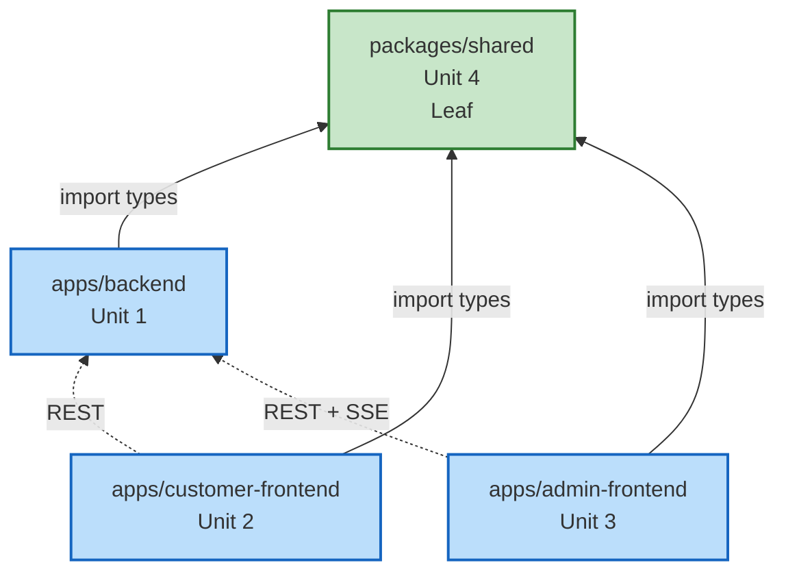
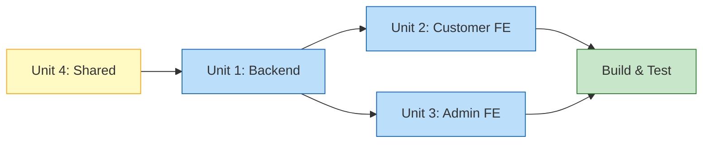

# Unit of Work Dependency — 테이블오더 서비스

## Dependency Matrix

| From ＼ To | Shared | Backend | Customer FE | Admin FE |
|---|---|---|---|---|
| **Shared** | — | ✗ | ✗ | ✗ |
| **Backend** | ✅ (types/const) | — | ✗ | ✗ |
| **Customer FE** | ✅ (types/const) | ✅ (REST at runtime) | — | ✗ |
| **Admin FE** | ✅ (types/const) | ✅ (REST + SSE at runtime) | ✗ | — |

Legend:
- ✅ = depends on
- ✗ = no direct dependency
- "build-time" = import from the package
- "runtime" = network call to the running service

---

## Dependency Types

| Dependency | From → To | Type | Contract |
|---|---|---|---|
| `@tableorder/shared` import | Backend → Shared | Build-time (TypeScript) | Shared types/constants |
| `@tableorder/shared` import | Customer FE → Shared | Build-time | DTO types, OrderStatus enum |
| `@tableorder/shared` import | Admin FE → Shared | Build-time | DTO types, OrderStatus enum |
| REST API | Customer FE → Backend | Runtime HTTP | OpenAPI 스타일 REST (JSON) |
| REST API | Admin FE → Backend | Runtime HTTP | 동일 |
| SSE | Admin FE → Backend | Runtime SSE | `text/event-stream`, OrderEvent 스키마 |

---

## Dependency Graph

---

## Build Order (Implementation Sequence)

**Critical Path**: Shared → Backend → (Customer FE ∥ Admin FE)

### 이유
1. **Shared 먼저**: Backend/FE 양쪽의 타입 계약이 잠김
2. **Backend 다음**: REST/SSE endpoint가 구현되어야 FE가 실제 호출 가능 (단, contract-first라면 FE를 mock과 병렬 개발 가능)
3. **Customer FE ∥ Admin FE**: 서로 의존 없음 → 병렬 가능

---

## Coordination Points

| Checkpoint | Across Units | Validation |
|---|---|---|
| DTO Contract | Shared ↔ Backend/FE | TypeScript 컴파일 통과 (brake on change) |
| REST 엔드포인트 스키마 | Backend ↔ FE | 엔드포인트 별 요청/응답 타입 일치 (shared types 사용) |
| SSE 이벤트 타입 | Backend ↔ Admin FE | `OrderEvent` discriminated union (shared) |
| 시드 데이터 기대값 | Backend seed ↔ FE dev | 기본 매장 ID, 관리자 계정(아이디/비번), 테이블 번호 example 문서화 |
| 인증 흐름 | Backend ↔ FE | JWT 16h / table token의 헤더 포맷(Bearer) 합의 |
| Build config | Monorepo root ↔ workspaces | `tsconfig.base.json`, `tsconfig.json` paths 공유 |

---

## Change Impact Rules

| 변경 | 영향받는 Unit | 조치 |
|---|---|---|
| `@tableorder/shared` DTO 추가/변경 | Backend + Customer FE + Admin FE | 모든 소비자 타입 재확인, 테스트 |
| Backend REST 엔드포인트 변경 | 호출하는 FE 전부 | API 버전/마이그레이션 필요 |
| Backend SSE 이벤트 포맷 변경 | Admin FE | OrderEvent 타입 먼저 수정 → backend 수정 순 |
| FE-only 변경 | 해당 FE only | 다른 유닛 영향 없음 |

---

## Parallelization Opportunities

- **Customer FE** ⇄ **Admin FE**: 완전 독립, 서로 import/호출 안 함 → 완전 병렬 가능
- Construction 단계에서 두 FE 유닛을 동일 세션(또는 병렬 세션)에서 설계/구현 가능
- Backend 구현 중이라도 FE는 mock(React Query 기반) + shared types 만으로 UI 뼈대 진행 가능
