# Execution Plan — 테이블오더 서비스

## Detailed Analysis Summary

### Project Type
- **Type**: Greenfield (신규)
- **Transformation Scope**: N/A
- **Reverse Engineering**: Skipped (기존 코드 없음)

### Change Impact Assessment
| 영역 | 해당 여부 | 설명 |
|---|---|---|
| User-facing | ✅ Yes | 고객 태블릿 UI + 관리자 웹 UI 신규 개발 |
| Structural | ✅ Yes | Frontend/Backend/DB 전체 아키텍처 신규 설계 |
| Data model | ✅ Yes | Store/Table/TableSession/Menu/Order/OrderHistory/AdminUser 신규 |
| API | ✅ Yes | REST API + SSE 스트리밍 엔드포인트 신규 |
| NFR | ✅ Yes | SSE 2초 이내 반영, bcrypt/JWT, 세션 16h |

### Risk Assessment
- **Risk Level**: **Low-Medium** (PoC 범위, 로컬 배포, 소규모)
- **Rollback Complexity**: Easy (로컬 개발, 운영 배포 없음)
- **Testing Complexity**: Moderate (상태 머신/세션 로직 검증 필요)

---

## Stage Decisions

### 🔵 INCEPTION PHASE (나머지)

| Stage | 결정 | Rationale |
|---|---|---|
| Application Design | **EXECUTE** | 다수의 도메인 엔티티(Store/Table/Session/Menu/Order), 여러 컴포넌트(Auth, Order, Menu, SSE broadcaster, Session manager) 신규 정의 필요. 컴포넌트 책임/메서드/의존 관계 명시 가치가 큼. |
| Units Generation | **EXECUTE** | 시스템을 구조적 단위로 분해 필요 — Backend / Customer Frontend / Admin Frontend 최소 3개 Unit. 각 단위별 독립 설계/테스트 가능. |

### 🟢 CONSTRUCTION PHASE (각 Unit 별)

| Stage | 결정 | Rationale |
|---|---|---|
| Functional Design | **EXECUTE** (per unit) | 주문 상태 머신, 세션 라이프사이클, 장바구니 계산 등 업무 로직 존재. 데이터 스키마 정의 필요. |
| NFR Requirements | **EXECUTE** (per unit) | SSE 2초 성능, bcrypt/JWT 보안, 16h 세션 등 NFR 존재. PoC 수준이지만 기술 스택 선정 근거 필요. |
| NFR Design | **EXECUTE** (per unit) | NFR Requirements 실행하므로 pattern 설계 필수 (SSE broadcast pattern, auth middleware, rate limiting 등). |
| Infrastructure Design | **SKIP** | 배포 환경이 "로컬/PoC"(Q1=C). 클라우드 리소스/IaC 불필요. 로컬 실행은 Code Generation의 npm scripts로 충분. |
| Code Generation | **EXECUTE (always)** | 실제 코드 생성. |
| Build and Test | **EXECUTE (always)** | 단위 테스트 실행 및 빌드 검증. |

### 🟡 OPERATIONS PHASE
- **Operations**: PLACEHOLDER (향후 확장)

---

## Proposed Units of Work

Units Generation 단계에서 확정되겠지만, 현재 분석상 예상되는 분해:

| # | Unit | 설명 | 주요 기술 |
|---|---|---|---|
| 1 | **Backend API** | Auth / Menu / Order / Table / Session / SSE 처리, SQLite persistence, 시드 스크립트 | Node.js + TypeScript (Express/NestJS), SQLite, Prisma 또는 TypeORM |
| 2 | **Customer Frontend** | 테이블 태블릿용 고객 UI (자동 로그인, 메뉴, 장바구니, 주문, 내 주문) | React + TypeScript |
| 3 | **Admin Frontend** | 관리자용 웹 UI (로그인, 실시간 대시보드 SSE, 테이블/메뉴 관리) | React + TypeScript |

(Shared Types Package 0.5 유닛을 더하는 옵션도 존재 — monorepo 구성 시)

---

## Workflow Visualization

```mermaid
flowchart TD
    Start(["User Request"])

    subgraph INCEPTION["🔵 INCEPTION PHASE"]
        WD["Workspace Detection<br/><b>COMPLETED</b>"]
        RA["Requirements Analysis<br/><b>COMPLETED</b>"]
        US["User Stories<br/><b>COMPLETED</b>"]
        WP["Workflow Planning<br/><b>IN PROGRESS</b>"]
        AD["Application Design<br/><b>EXECUTE</b>"]
        UG["Units Generation<br/><b>EXECUTE</b>"]
    end

    subgraph CONSTRUCTION["🟢 CONSTRUCTION PHASE (per unit)"]
        FD["Functional Design<br/><b>EXECUTE</b>"]
        NFRA["NFR Requirements<br/><b>EXECUTE</b>"]
        NFRD["NFR Design<br/><b>EXECUTE</b>"]
        ID["Infrastructure Design<br/><b>SKIP</b>"]
        CG["Code Generation<br/><b>EXECUTE</b>"]
        BT["Build and Test<br/><b>EXECUTE</b>"]
    end

    subgraph OPERATIONS["🟡 OPERATIONS PHASE"]
        OPS["Operations<br/><b>PLACEHOLDER</b>"]
    end

    Start --> WD
    WD --> RA
    RA --> US
    US --> WP
    WP --> AD
    AD --> UG
    UG --> FD
    FD --> NFRA
    NFRA --> NFRD
    NFRD --> ID
    ID --> CG
    CG --> BT
    BT --> OPS
    OPS --> End(["Complete"])

    style WD fill:#4CAF50,stroke:#1B5E20,stroke-width:3px,color:#fff
    style RA fill:#4CAF50,stroke:#1B5E20,stroke-width:3px,color:#fff
    style US fill:#4CAF50,stroke:#1B5E20,stroke-width:3px,color:#fff
    style WP fill:#4CAF50,stroke:#1B5E20,stroke-width:3px,color:#fff
    style AD fill:#FFA726,stroke:#E65100,stroke-width:3px,stroke-dasharray: 5 5,color:#000
    style UG fill:#FFA726,stroke:#E65100,stroke-width:3px,stroke-dasharray: 5 5,color:#000
    style FD fill:#FFA726,stroke:#E65100,stroke-width:3px,stroke-dasharray: 5 5,color:#000
    style NFRA fill:#FFA726,stroke:#E65100,stroke-width:3px,stroke-dasharray: 5 5,color:#000
    style NFRD fill:#FFA726,stroke:#E65100,stroke-width:3px,stroke-dasharray: 5 5,color:#000
    style ID fill:#BDBDBD,stroke:#424242,stroke-width:2px,stroke-dasharray: 5 5,color:#000
    style CG fill:#4CAF50,stroke:#1B5E20,stroke-width:3px,color:#fff
    style BT fill:#4CAF50,stroke:#1B5E20,stroke-width:3px,color:#fff
    style OPS fill:#FFF59D,stroke:#F57F17,stroke-width:2px,color:#000
    style Start fill:#CE93D8,stroke:#6A1B9A,stroke-width:3px,color:#000
    style End fill:#CE93D8,stroke:#6A1B9A,stroke-width:3px,color:#000

    linkStyle default stroke:#333,stroke-width:2px
```

---

## Phases to Execute (체크리스트)

### 🔵 INCEPTION PHASE
- [x] Workspace Detection
- [x] Requirements Analysis
- [x] User Stories
- [x] Workflow Planning (진행 중)
- [ ] Application Design — **EXECUTE**
- [ ] Units Generation — **EXECUTE**

### 🟢 CONSTRUCTION PHASE (각 Unit 별 반복)
- [ ] Functional Design — **EXECUTE** (per unit)
- [ ] NFR Requirements — **EXECUTE** (per unit)
- [ ] NFR Design — **EXECUTE** (per unit)
- [ ] Infrastructure Design — **SKIP** (로컬 PoC)
- [ ] Code Generation — **EXECUTE** (per unit)
- [ ] Build and Test — **EXECUTE** (all units)

### 🟡 OPERATIONS PHASE
- [ ] Operations — PLACEHOLDER

---

## Estimated Timeline

| Stage | 예상 소요 |
|---|---|
| Application Design | 단기 (도메인 모델/컴포넌트 정의) |
| Units Generation | 단기 (3개 유닛 분해) |
| Construction per Unit (Backend) | 중기 (가장 많은 코드) |
| Construction per Unit (Customer FE) | 중기 |
| Construction per Unit (Admin FE) | 중기 |
| Build and Test | 단기 |

> PoC 범위이므로 총 workflow는 수 세션 내 완료 가능

---

## Success Criteria

- **Primary Goal**: 로컬에서 실행 가능한 테이블오더 MVP (고객 UI + 관리자 UI + Backend + SQLite)
- **Key Deliverables**:
  - 작동하는 Backend API (REST + SSE)
  - 고객 Frontend (자동 로그인 → 메뉴 → 장바구니 → 주문)
  - 관리자 Frontend (로그인 → 실시간 대시보드 → 테이블/메뉴 관리)
  - 시드 스크립트 (매장/관리자/메뉴 예시 데이터)
  - 단위 테스트 (핵심 비즈니스 로직)
  - 로컬 실행 가이드 (build-and-test 문서)
- **Quality Gates**:
  - 모든 Must 스토리의 AC(Given/When/Then) 충족
  - 상태 머신 역방향 전환 테스트 통과
  - SSE 2초 이내 반영 확인
  - 단위 테스트 통과

---

## Extension Compliance
| Rule | 상태 | 비고 |
|---|---|---|
| Security Baseline | N/A | 사용자 opt-out |
| Property-Based Testing | N/A | 사용자 opt-out |
